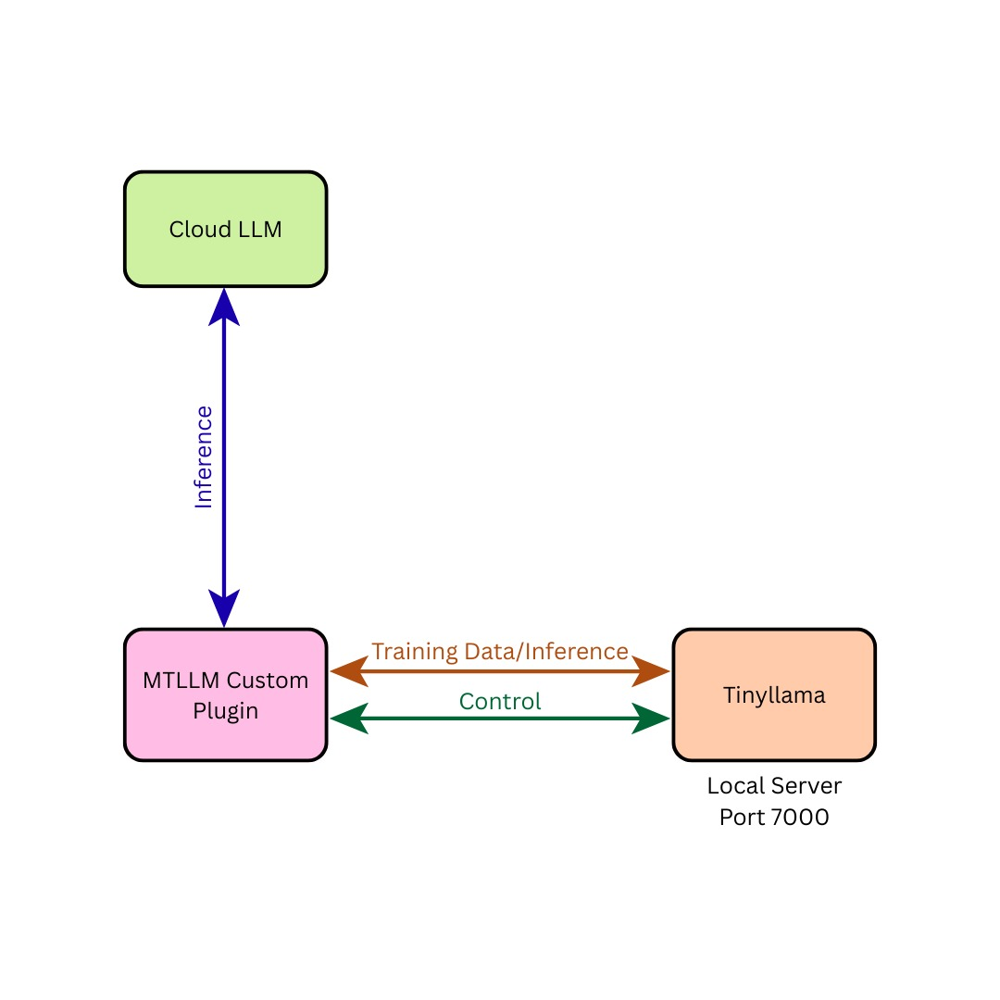
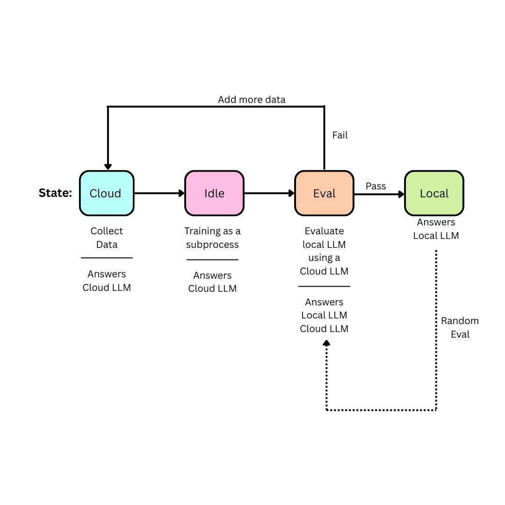

# 💮 Araliya Tiny-byLLM Plugin

Seamlessly integrates byllm calls with TinyLlama through a local tiny-server, supporting fine-tuning and evaluation workflows.

[](http://www.youtube.com/watch?v=5T9eMUqUlZs "Watch the Demo")

> **🎥 Watch the demo:** [Araliya - mtllm plugin for tinyllama](http://www.youtube.com/watch?v=5T9eMUqUlZs)

---

## 🚀 Quick Start


### 🔧Tiny-byLLM(Plugin)

**Installation**
```bash
cd tiny-byllm/
pip install -e .
```

### 🖥️ Run Tiny Server

**Install dependencies:**

```bash
pip install fastapi "uvicorn[standard]" accelerate outlines transformers peft datasets
```

**Run the server:**

```bash
cd tiny-server/
uvicorn app:app --host 0.0.0.0 --port 7000
```
---

## ✨ Features

🔌 Seamless Jac integration

🧠 TinyLlama 1.1B backbone

🔄 Intelligent training & evaluation process

🌐 Independent OpenAI API–compatible tiny-server

🎛 Hot-swappable LoRA adapters (as for multitask usage — to be added)

   
---

## 🔧 Compatibility

✅ Updated to work with byllm

🗂 Use the mtllm-compatible branch for mtllm (deprecated)

---

## 🏗️ System Architecture

<p align="center">
  
</p>

The plugin intercepts **byllm** calls and, depending on the mode set by the **tiny-server**, routes inference either to:

- 🖥️ A local **TinyLLaMA server** (running on port 7000)  
- ☁️ A **cloud LLM**

---

### 🔄 Local TinyLLaMA Server Exchanges
- 📂 **Exchange Training Data / Inference results** with the plugin  
- ⚙️ **Control signals** to manage fine-tuning, evaluation or mode switch
  *(the available control endpoints are documented in the tiny-server README)*

---

### 🌐 tiny-server
- An **OpenAI API–compatible server**  
- Supports **constrained decoding** through *outlines*, enabling structured output generation  
- Allows seamless switching between **local** and **cloud backends**  
- Ensures flexible, reliable integration with **Jac**

## 🔄 Adaptive Mode Cycle

<p align="center">
  
</p>

🌐 **Cloud Mode** – The system operates fully on the cloud LLM, both to answer queries and to collect training data for the local model.

💤 **Idle Mode** – Training of the local TinyLLaMA runs as a subprocess, while the cloud LLM continues handling responses.

🧪 **Eval Mode** – The local model’s answers are generated and then sent to the cloud LLM for evaluation.

❌ If the local model’s answers fail, the system returns to **Cloud Mode** to gather more data and continue training.

✅ If the local model passes multiple evaluations in a row, the system advances to **Local Mode**.

💻 **Local Mode** – The local TinyLLaMA serves answers directly. To ensure ongoing quality, it periodically performs random evaluation checks. If a random eval fails, the system reverts to training mode and resumes the cycle to further improve the local model.


